# 1 How to configure, perform an ADB install of ORDS in an OCI Compute Instance, and deploy in Standalone mode: 2025 Edition

<!-- ## 2 Some questions

- What happens when you install ORDS in a compute instance, in OCI, with the `sudo dnf install ords -y` command?
- What does the configuration folder structure look like?
- What does the bin look like?
- What are the users that install and invoke the `ords serve` command?
- Detail the steps for installing sqlcl, and java.
- Do you need to explicitly set the `PATH`s for the ORDS `/bin` and SQLcl `/bin`? Or is that already done with the `sudo dnf install [product]` command? -->

## 2 Database details

I assume you have an ADB that is already up and running. And that you are the `ADMIN` user.

Here are some select details about the Autonomous datbase used for this demonstration:

| Field | Details |
| ---- | --------------- |
| Name | tempadb |
| Workload type | Data Warehouse|  
| Database Version | 23ai |

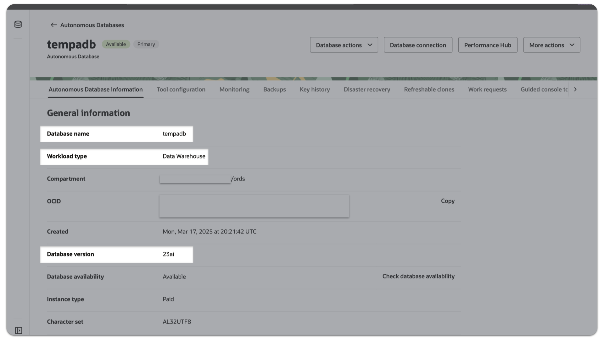

## 3 Compute Instance

The same assumptions apply; that you already have an OCI Compute Instance up and running.

> :bulb: If not, you create and connect to your first OCI Compute Instance. [Learn how](https://docs.oracle.com/en-us/iaas/Content/Compute/tutorials/first-linux-instance/overview.htm). That will get you most of the way there. FYI, I'm using a Linux instance *not* Ubuntu.

Below are the details of the compute instance I'm using in this demonstration:

| Field | Details | Notes |
| ---- | --------------- | ------------- |
| Name | test_instance_02 | |
| Linux OS | 9.5| 2025-02-28-0 build[^3] |
|Shape | AMD VM.Standard.E4.Flex | |
| OCPU count | 1 | |
| Network bandwidth | 1 Gbps | |
| Memory | 16GB ||
| Local disk | Block storage only | |

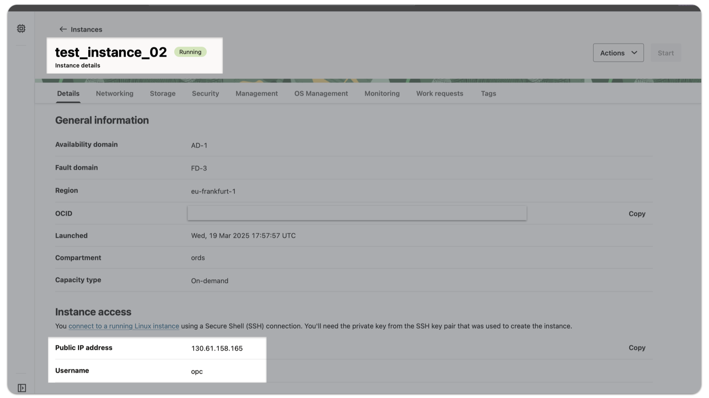

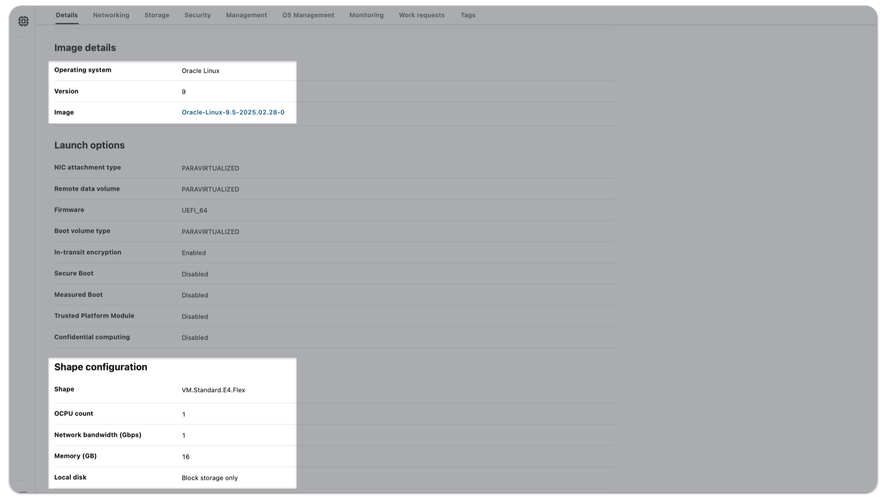

[^3]: When you view the compute instance details in the OCI dashboard, the OS shows what looks to be a "fully-qualified" version. However, when you first create your compute instance, you'll see soemthing like `Linux 9`. Not really relevant, but nice to be aware of. But when you view the details (after the instance has provisioned) it will show something like this: `Oracle-Linux-9.5-2025.02.28-0`. If you intend on doing anything with Terraform stacks, I believe you'll use `9.5` as the OS. Just noting for the future.

### 3.1 Connecting to the the Compute Instance

> :bulb: How to connect to a Linux instance. [Take me there](https://docs.oracle.com/en-us/iaas/Content/Compute/Tasks/connect-to-linux-instance.htm).

I will assume you've followed the instructions in that link above. The only minor difference is that I've placed my compute instance's private key file in my `.ssh` folder (this makes connecting to my compute instance somewhat simpler).

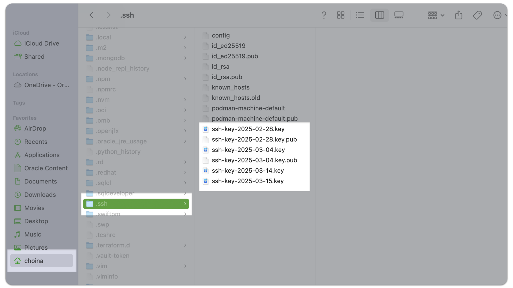

Otherwise I followed the same exact steps in that tutorial. Here are the steps I took:

1. I `cd'd` to the `.ssh` folder/directory on my local computer (my Macbook).
2. I then issued the `chmod 400 [your private key file]` command to change the file's permissions[^31]
3. Use `ssh -i [your private key file] opc@[your compute's public IP address`. Accept the "Are you sure you want to continue connecting (yes/no/[fingerprint])?" question (i.e. "yes").
4. You'll be logged in as the `opc` user.

> :memo: **Note:** Just an FYI, you'll find yourself in the `/home/opc` directory. It's good to know where you are at all times, because a lot is about to happen in the next few steps, and it is *extremely easy* to get lost.

[^31]: `chmod 400` can be translated as "the current user has read-only access." Learn more about the [chmod](https://ss64.com/bash/chmod.html) commmand. While you are there, enter `400` in that file permissions table to see the how the `read/write/execute` permissions change for the `Owner/Group/Other` fields.

<!-- Here is where things are unclear. Should we switch users now, to the `oracle` user? Or should we issue the `sudo ords install`, `sudo sqlcl install`, and `sudo graalvm install` commands as `opc`? -->

> :mag_right: **Explore:** While you are logged in as the `opc` user, you should `cd /` to the top-most level of the compute instance. This is a great opportunity to see your directories *before* you begin altering/adding anything. Using the `ls -a` command, I observed the following:
>
> 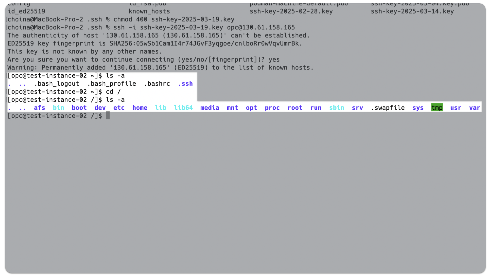
>
> ```sh
> .  ..  afs  bin  boot  dev  etc  home  lib  lib64  media  mnt  opt  proc  root  run  sbin  srv  .swapfile  sys  tmp  usr  var
> ```
>
> When you are done, issue the `cd /home/opc` to get back to where you came from.
>
> 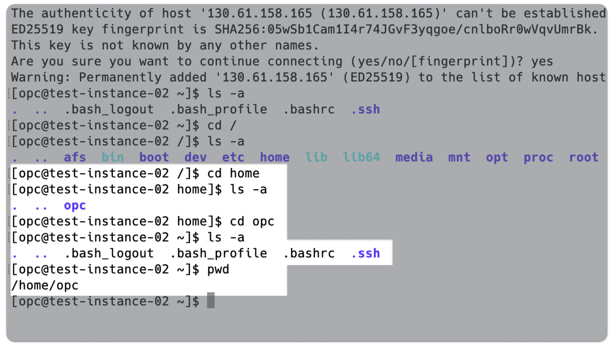

Onto the set up. Next I'll install my "dependencies":

- ORDS
- SQLcl
- GraalVM

### 3.2 Installing dependencies

Depending on what version of ORDS you are installing, you'll need the minimum version of Java. It doesn't look as though Java is configured on these base Linux machines, but we can fix that soon enough. You'll also want to obtain ORDS and SQLcl from the Oracle Linux Yum repositories. I walk through those steps next.

#### 3.2.1 ORDS

I should be clear, you aren't installing ORDS, you are just pulling the ORDS RPM into your compute instance. If you are on Linux 8 or above you can use `dnf`as it is more performant.[^321]

[^321]: Why `dnf` and not `yum`? In short, `dnf` is better. For...reasons. I'm not an expert, I just read up, and the do what I'm told. But [here is some background](https://docs.oracle.com/en/operating-systems/oracle-linux/8/relnotes8.0/ol8-NewFeaturesandChanges.html#ol8-features-yum) on the support for *Dandified yum* or `dnf`. Who comes up with these names?

`sudo dnf install ords -y`

> :bulb: **TIP:** Including the `-y` saves you from having to manually accept the installation of the RPM. The same applies for SQLcl, and Java. In the future will automate this using a Terraform stack. So at this stage we are doing two things here: (1) documenting how to do this in 2025 and (2) prepping for the next phase (Terraform).

:memo: **NOTE:** Pay attention to the helpful notes, after the ORDS RPM has been installed.

```sh
WARN: ORDS requires Java 17.
        You can install Oracle Java at https://www.oracle.com/java/technologies/downloads/#java17.
INFO: Before starting ORDS service, run the below command as user oracle:
        ords --config /etc/ords/config install
INFO: To enable the ORDS service during startup, run the below command:
        sudo  systemctl enable ords
```

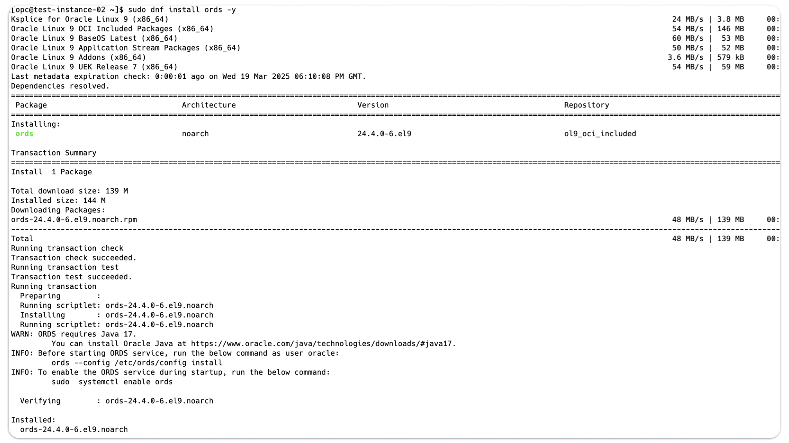

> **:memo: NOTE:** This isn't the same as installing ORDS to "talk" to your database. All this does is install the ORDS product folder. You'll still have to configure it.

If you issue a `cd ..` command, you'll move up a folder. You should now see the following:

```sh
.  ..  opc  oracle
```

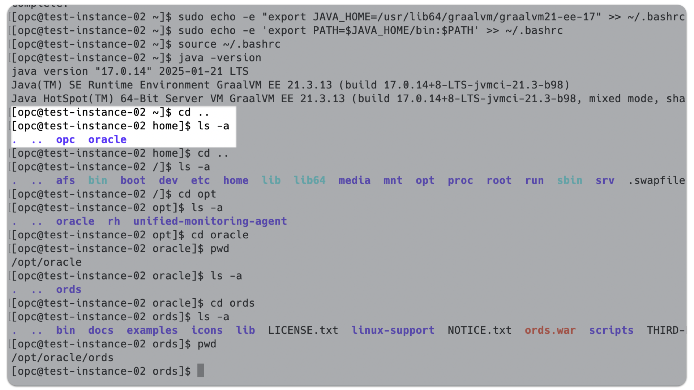

Whereas, before the ORDS install, you would have seen only:

```sh
.  ..  opc
```

I don't have an image of this. But I've also confirmed, internally, that we create this `oracle` user for you when you pull down that ORDS RPM (thanks Adrian 🙂)

#### 3.2.2 SQLcl

For this exercise, you don't need SQLcl yet, but we are setting it up for future steps.

`sudo dnf install sqlcl -y`

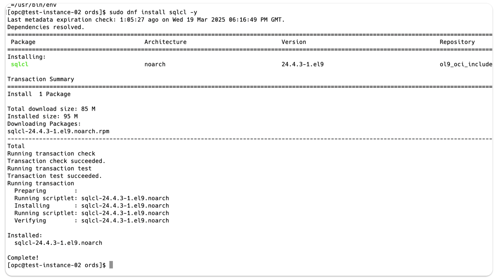

> :memo: **NOTE:** If you are loosely following these steps, and you attempt to issue a SQLcl command (like `sql /nolog`), you'll recieve an error similar to this:
>
> ```sh
> Error: SQLcl requires Java 11 and above to run.
>     Found Java version no_java.
>     Please set JAVA_HOME to appropriate version.
> ```
>
> It is only because you haven't set up Java yet. Otherwise, if you have set up Java, or already have a supported version installed, you *can* issue the `sql /nolog` command.
>
> 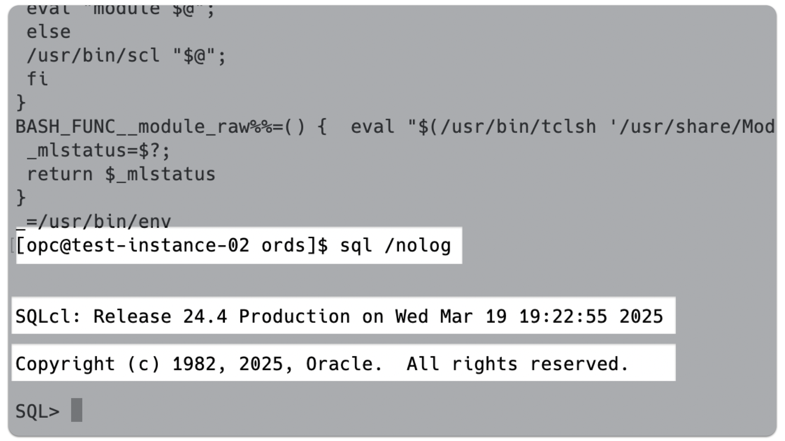

<!-- It looks like Java isn't installed or configured. Is that correct? Issuing the `which java` command and you'll get:

```sh
/usr/bin/which: no java in (/home/opc/.local/bin:/home/opc/bin:/usr/share/Modules/bin:/usr/local/bin:/usr/bin:/usr/local/sbin:/usr/sbin)
```

  > :memo: **NOTE:** At this point, if I issue the `env` command (`ENV` doesn't work for some reason), I'll see the following:
  >
  > ```sh
> SHELL=/bin/bash
> HISTCONTROL=ignoredups
> HISTSIZE=1000
> HOSTNAME=testinstance01
> PWD=/home
> LOGNAME=opc
> XDG_SESSION_TYPE=tty
> MODULESHOME=/usr/share/Modules
> MANPATH=/usr/share/man:
> MOTD_SHOWN=pam
> __MODULES_SHARE_MANPATH=:1
> HOME=/home/opc
> LANG=en_US.UTF-8
> LS_COLORS=rs=0:di=01;34:ln=01;36:mh=00:pi=40;33:so=01;35:do=01;35:bd=40;33;01:cd=40;33;01:or=40;31;01:mi=01;37;41:su=37;41:sg=30;43:ca=30;41:tw=30;42:ow=34;42:st=37;44:ex=01;32:*.tar=01;31:*.tgz=01;31:*.arc=01;31:*.arj=01;31:*.taz=01;31:*.lha=01;31:*.lz4=01;31:*.lzh=01;31:*.lzma=01;31:*.tlz=01;31:*.txz=01;31:*.tzo=01;31:*.t7z=01;31:*.zip=01;31:*.z=01;31:*.dz=01;31:*.gz=01;31:*.lrz=01;31:*.lz=01;31:*.lzo=01;31:*.xz=01;31:*.zst=01;31:*.tzst=01;31:*.bz2=01;31:*.bz=01;31:*.tbz=01;31:*.tbz2=01;31:*.tz=01;31:*.deb=01;31:*.rpm=01;31:*.jar=01;31:*.war=01;31:*.ear=01;31:*.sar=01;31:*.rar=01;31:*.alz=01;31:*.ace=01;31:*.zoo=01;31:*.cpio=01;31:*.7z=01;31:*.rz=01;31:*.cab=01;31:*.wim=01;31:*.swm=01;31:*.dwm=01;31:*.esd=01;31:*.jpg=01;35:*.jpeg=01;35:*.mjpg=01;35:*.mjpeg=01;35:*.gif=01;35:*.bmp=01;35:*.pbm=01;35:*.pgm=01;35:*.ppm=01;35:*.tga=01;35:*.xbm=01;35:*.xpm=01;35:*.tif=01;35:*.tiff=01;35:*.png=01;35:*.svg=01;35:*.svgz=01;35:*.mng=01;35:*.pcx=01;35:*.mov=01;35:*.mpg=01;35:*.mpeg=01;35:*.m2v=01;35:*.mkv=01;35:*.webm=01;35:*.webp=01;35:*.ogm=01;35:*.mp4=01;35:*.m4v=01;35:*.mp4v=01;35:*.vob=01;35:*.qt=01;35:*.nuv=01;35:*.wmv=01;35:*.asf=01;35:*.rm=01;35:*.rmvb=01;35:*.flc=01;35:*.avi=01;35:*.fli=01;35:*.flv=01;35:*.gl=01;35:*.dl=01;35:*.xcf=01;35:*.xwd=01;35:*.yuv=01;35:*.cgm=01;35:*.emf=01;35:*.ogv=01;35:*.ogx=01;35:*.aac=01;36:*.au=01;36:*.flac=01;36:*.m4a=01;36:*.mid=01;36:*.midi=01;36:*.mka=01;36:*.mp3=01;36:*.mpc=01;36:*.ogg=01;36:*.ra=01;36:*.wav=01;36:*.oga=01;36:*.opus=01;36:*.spx=01;36:*.xspf=01;36:
> SSH_CONNECTION=136.56.69.68 49876 10.0.0.153 22
> XDG_SESSION_CLASS=user
> SELINUX_ROLE_REQUESTED=
> TERM=xterm-256color
> LESSOPEN=||/usr/bin/lesspipe.sh %s
> USER=opc
> MODULES_RUN_QUARANTINE=LD_LIBRARY_PATH LD_PRELOAD
> LOADEDMODULES=
> SELINUX_USE_CURRENT_RANGE=
> SHLVL=1
> XDG_SESSION_ID=6
> XDG_RUNTIME_DIR=/run/user/1000
> SSH_CLIENT=136.56.69.68 49876 22
> __MODULES_LMINIT=module use --append /usr/share/Modules/modulefiles:module use --append /etc/modulefiles:module use --append /usr/share/modulefiles
> which_declare=declare -f
> PATH=/home/opc/.local/bin:/home/opc/bin:/usr/share/Modules/bin:/usr/local/bin:/usr/bin:/usr/local/sbin:/usr/sbin
> SELINUX_LEVEL_REQUESTED=
> MODULEPATH=/etc/scl/modulefiles:/usr/share/Modules/modulefiles:/etc/modulefiles:/usr/share/modulefiles
> DBUS_SESSION_BUS_ADDRESS=unix:path=/run/user/1000/bus
> MAIL=/var/spool/mail/opc
> SSH_TTY=/dev/pts/0
> MODULES_CMD=/usr/share/Modules/libexec/modulecmd.tcl
> BASH_FUNC_ml%%=() {  module ml "$@"
> }
> BASH_FUNC_which%%=() {  ( alias;
>  eval ${which_declare} ) | /usr/bin/which --tty-only --read-alias --read-functions --show-tilde --show-dot $@
> }
> BASH_FUNC_module%%=() {  local _mlredir=1;
>  if [ -n "${MODULES_REDIRECT_OUTPUT+x}" ]; then
>  if [ "$MODULES_REDIRECT_OUTPUT" = '0' ]; then
>  _mlredir=0;
>  else
>  if [ "$MODULES_REDIRECT_OUTPUT" = '1' ]; then
>  _mlredir=1;
>  fi;
>  fi;
>  fi;
>  case " $@ " in 
>  *' --no-redirect '*)
>  _mlredir=0
>  ;;
>  *' --redirect '*)
>  _mlredir=1
>  ;;
>  esac;
>  if [ $_mlredir -eq 0 ]; then
>  _module_raw "$@";
>  else
>  _module_raw "$@" 2>&1;
>  fi
> }
> BASH_FUNC_scl%%=() {  if [ "$1" = "load" -o "$1" = "unload" ]; then
>  eval "module $@";
>  else
>  /usr/bin/scl "$@";
>  fi
> }
> BASH_FUNC__module_raw%%=() {  eval "$(/usr/bin/tclsh '/usr/share/Modules/libexec/modulecmd.tcl' bash "$@")";
>  _mlstatus=$?;
>  return $_mlstatus
> }
> _=/usr/bin/env
> OLDPWD=/home/opc
> ``` -->
<!-- 
   Actually, it looks like you don't even need to set the `$PATH` for the SQLcl `/bin` directory. It [seems like](https://docs.oracle.com/en/database/oracle/sql-developer-command-line/24.4/sqcug/working-sqlcl.html) the only dependency is Java. Onto Java, or GraalVM in this case. -->

#### 3.2.3 GraalVM 21 Enterprise Edition (based on Java 17 JDK)

There are two commands that I issued. One for GraalVM[^3231] [^3232], the other for the JavaScript component:

[^3231]: Why GraalVM 21 Enterprise Edition (based on Java 17 JDK)? For one, its a pretty stable release. Secondly, at some point between GraalVM 21 and 23 (not to be confused with the Enterprise Edition which has its own versioning) deprecated the `gu` installer. I still need to work out the steps for manually installing the JavaScript component on the later versions of GraalVM. This version works just fine for the latest version of ORDS and SQLcl.

[^3232]: The GraalVM installation seen here are based, in part, on the steps [found here](https://docs.oracle.com/en/learn/get-started-with-graalvm-on-oracle-linux/#task-2-install-graalvm-enterprise-oracle-linux).

`sudo dnf install graalvm21-ee-17 -y`

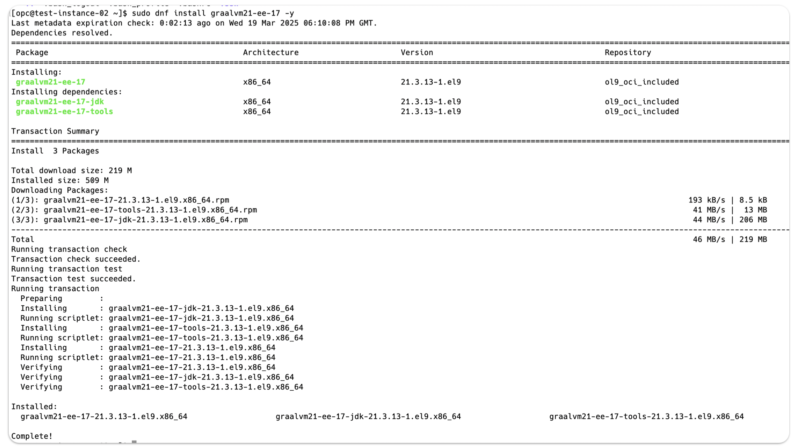

`sudo dnf install graalvm21-ee-17-javascript -y`

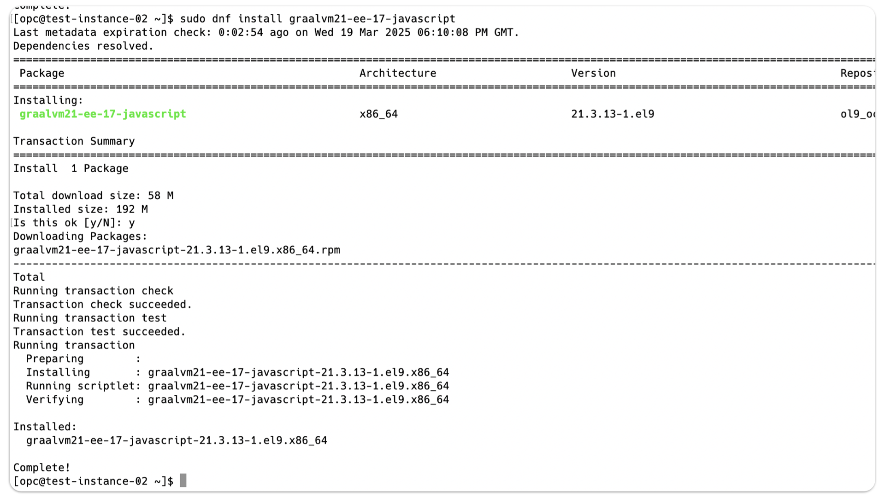

##### 3.2.3.1 Setting `JAVA` environment variables

You need to set your `JAVA_HOME`, followed by setting it in the `PATH` environment variable.

The commands I used, in order:

1. `sudo echo -e "export JAVA_HOME=/usr/lib64/graalvm/graalvm21-ee-17" >> ~/.bashrc`

2. `sudo echo -e 'export PATH=$JAVA_HOME/bin:$PATH' >> ~/.bashrc`

3. `source ~/.bashrc`

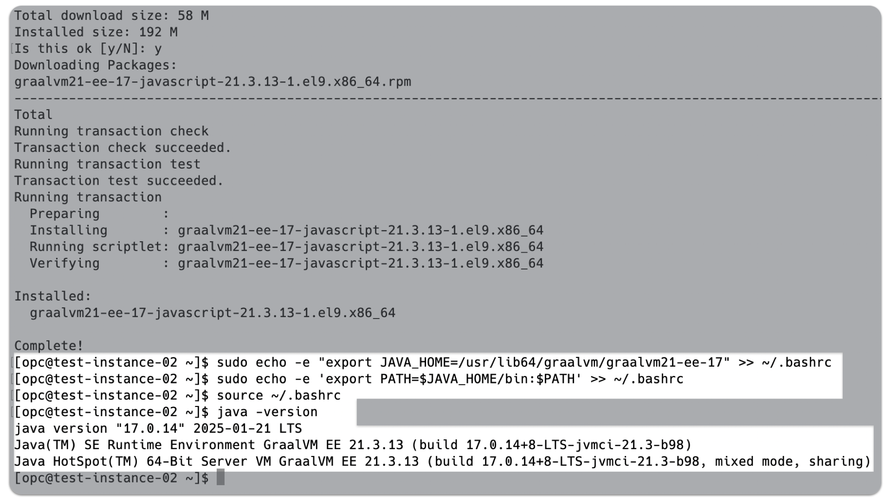

> :bulb: [Read up](ttps://ss64.com/bash/source.html) on the `source` command.

*Now* if I issue the `java -version` command I will see:

```sh
[opc@test-instance-02 ~]$ java -version
java version "17.0.14" 2025-01-21 LTS
Java(TM) SE Runtime Environment GraalVM EE 21.3.13 (build 17.0.14+8-LTS-jvmci-21.3-b98)
Java HotSpot(TM) 64-Bit Server VM GraalVM EE 21.3.13 (build 17.0.14+8-LTS-jvmci-21.3-b98, mixed mode, sharing)
```

## 3.2.4 What do we know so far?

Here are some observations at this point (in no particular order):

1. In the `/opt/oracle` directory, there are two sub-directories: `/ords` and `/sqlcl`.  

    The `opt/oracle/ords` directory consists of the following directories and files:  

    ```sh
    .  ..  bin  docs  examples  icons  lib  LICENSE.txt  linux-support  NOTICE.txt  ords.war  scripts  THIRD-PARTY-LICENSES.txt
    ```

    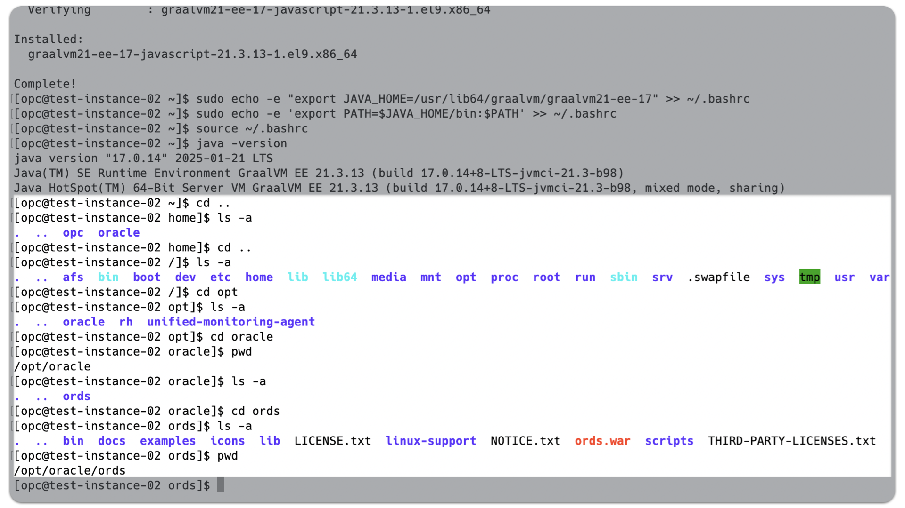

    While the `opt/oracle/sqlcl` directory consists of:

    ```sh
    .  ..  bin  lib  LICENSE.txt  NOTICES.txt  THIRD-PARTY-LICENSES.txt
    ```

2. However, the `/etc` directory *also* has an `ords` directory *and* an `ords.conf` file. This `ords` directory contains a `config` subfolder. It is currently empty.

   These are both located at: `/etc/ords` and `/etc/ords.conf`.

   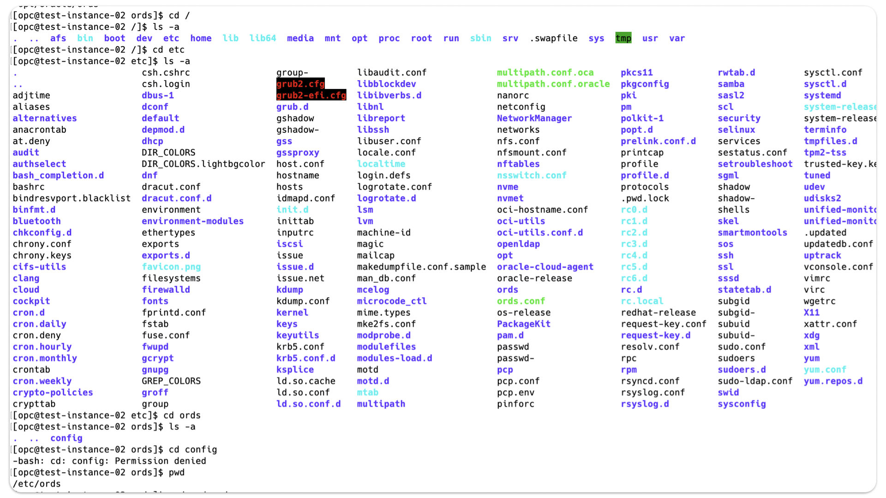

   > :question: What happens when I switch to the `oracle` user, with the `sudo su - oracle` command? And *then* try to peek into these?  
   >
   > Answer: Nothing. As the `oracle` user, the `/opt/oracle/ords` directory is identical.
   >
   > ```sh
   > .  ..  bin  docs  examples  icons  lib  LICENSE.txt  linux-support  NOTICE.txt  ords.war  scripts  THIRD-PARTY-LICENSES.txt
   > ```
   >
   > 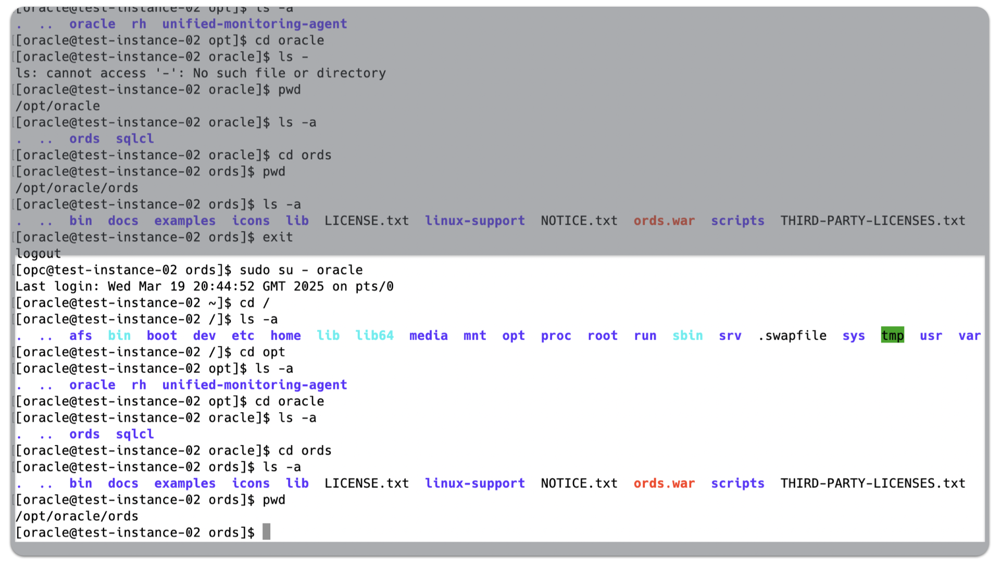

## 4 Beginning ORDS install

### 4.1 Add the ORDS <code>bin</code> to your <code>$PATH</code>

This step can really be done anytime between the time you installed the ORDS RPM into your compute instance until you issue the `ords serve` command. The complete steps are in [our docs](https://docs.oracle.com/en/database/oracle/oracle-rest-data-services/24.4/ordig/installing-and-configuring-oracle-rest-data-services.html#GUID-D86804FC-4365-4499-B170-2F901C971D30). Below is an abbreviated demonstration.  

Commands I issued:

```sh
echo -e 'export PATH="$PATH:/opt/oracle/ords/bin"' >> ~/.bash_profile
source ~/.bash_profile
```

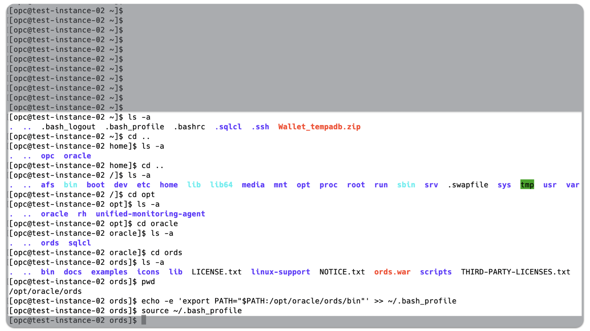

And if you are curious, you can issue the `env` command to review your current environment variables. You should see mentions of GraalVM as well as the ORDS `/bin`.

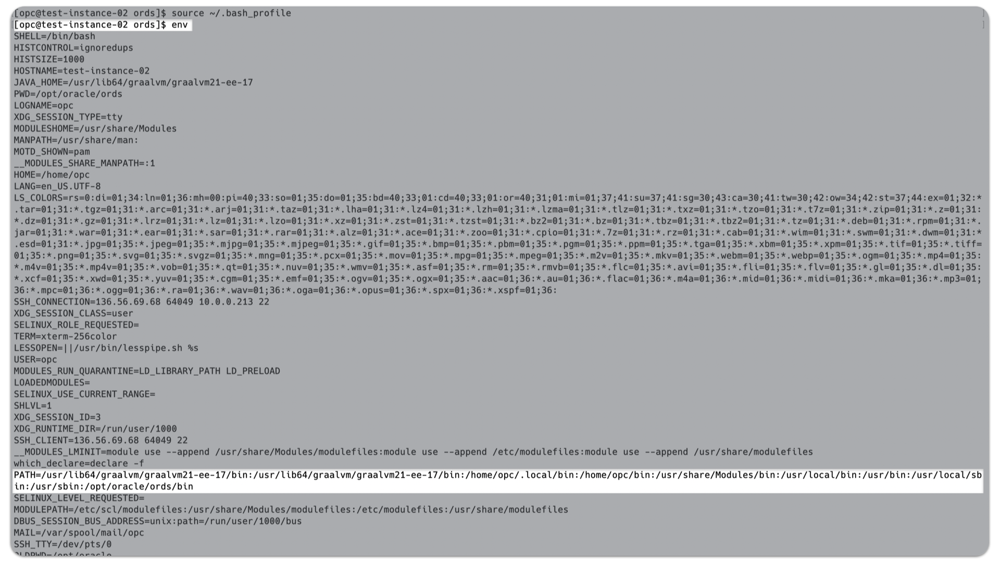

<!-- We used `./bashrc` when setting Java. But we use `./bash_profile` when setting the ORDS `/bin`, so what is it? What is preferred or more correct; `./bashrc` or `./bash_profile`? Details  -->

### 4.2 Open up your compute instance's ports

You can open up your ports anytime prior to starting up ORDS for the first time. Nothing you do between now and the moment before you issue the `ords serve` command are dependent on ports being open.

However its easier to do this now, to reduce switching back and forth between users. As the `opc` user, issue the following commands:

```sh
sudo firewall-cmd --permanent  --add-port=8080/tcp
sudo firewall-cmd --permanent  --add-port=8443/tcp
sudo firewall-cmd --permanent  --add-port=443/tcp
sudo firewall-cmd --permanent  --add-port=80/tcp
sudo firewall-cmd --reload
```

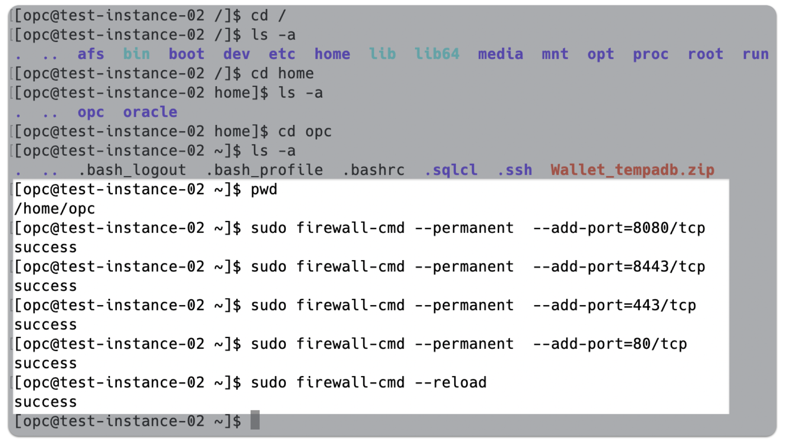

If you want to inspect what you just did, you can issue the `sudo firewall-cmd --list-all-zones` command to review your firewall settings.[^41] I'm including an image. And below that image is a complete print out of what I observed in my compute instance's terminal.

[^41]: You owe it to yourself to read about the firewall utility. We often gloss over it in tutorials, but [here are the docs](https://firewalld.org/documentation/man-pages/firewall-cmd.html) for reference.

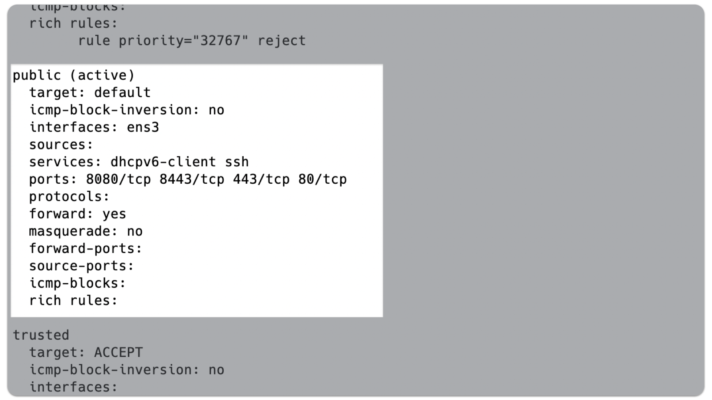

```sh
[opc@test-instance-02 ~]$ sudo firewall-cmd --list-all-zones
block
  target: %%REJECT%%
  icmp-block-inversion: no
  interfaces: 
  sources: 
  services: 
  ports: 
  protocols: 
  forward: yes
  masquerade: no
  forward-ports: 
  source-ports: 
  icmp-blocks: 
  rich rules: 

dmz
  target: default
  icmp-block-inversion: no
  interfaces: 
  sources: 
  services: ssh
  ports: 
  protocols: 
  forward: yes
  masquerade: no
  forward-ports: 
  source-ports: 
  icmp-blocks: 
  rich rules: 

drop
  target: DROP
  icmp-block-inversion: no
  interfaces: 
  sources: 
  services: 
  ports: 
  protocols: 
  forward: yes
  masquerade: no
  forward-ports: 
  source-ports: 
  icmp-blocks: 
  rich rules: 

external
  target: default
  icmp-block-inversion: no
  interfaces: 
  sources: 
  services: ssh
  ports: 
  protocols: 
  forward: yes
  masquerade: yes
  forward-ports: 
  source-ports: 
  icmp-blocks: 
  rich rules: 

home
  target: default
  icmp-block-inversion: no
  interfaces: 
  sources: 
  services: cockpit dhcpv6-client mdns samba-client ssh
  ports: 
  protocols: 
  forward: yes
  masquerade: no
  forward-ports: 
  source-ports: 
  icmp-blocks: 
  rich rules: 

internal
  target: default
  icmp-block-inversion: no
  interfaces: 
  sources: 
  services: cockpit dhcpv6-client mdns samba-client ssh
  ports: 
  protocols: 
  forward: yes
  masquerade: no
  forward-ports: 
  source-ports: 
  icmp-blocks: 
  rich rules: 

nm-shared
  target: ACCEPT
  icmp-block-inversion: no
  interfaces: 
  sources: 
  services: dhcp dns ssh
  ports: 
  protocols: icmp ipv6-icmp
  forward: no
  masquerade: no
  forward-ports: 
  source-ports: 
  icmp-blocks: 
  rich rules: 
	rule priority="32767" reject

public (active)
  target: default
  icmp-block-inversion: no
  interfaces: ens3
  sources: 
  services: dhcpv6-client ssh
  ports: 8080/tcp 8443/tcp 443/tcp 80/tcp
  protocols: 
  forward: yes
  masquerade: no
  forward-ports: 
  source-ports: 
  icmp-blocks: 
  rich rules: 

trusted
  target: ACCEPT
  icmp-block-inversion: no
  interfaces: 
  sources: 
  services: 
  ports: 
  protocols: 
  forward: yes
  masquerade: no
  forward-ports: 
  source-ports: 
  icmp-blocks: 
  rich rules: 

work
  target: default
  icmp-block-inversion: no
  interfaces: 
  sources: 
  services: cockpit dhcpv6-client ssh
  ports: 
  protocols: 
  forward: yes
  masquerade: no
  forward-ports: 
  source-ports: 
  icmp-blocks: 
  rich rules: 


```

> :memo: **NOTE:** We "opened" up ports `8080`, `8443`, `80`, and `443` for a few different reasons. In the immediate future, we are installing ORDS, and it will use port 8080 to route HTTP traffic *from* an incoming client's request *to* the database, and back again.
>
> And yes, I am aware 8080 is not secure. In phase two of this configuration we are adding more ORDS instances, but we are placing a Load Balancer in front of them. So, some of this will change in the near future. Port 80 and 443 are open for the Load Balancer's Health Checker. If none of that means anything to you, don't worry. It will soon enough.

### 4.2 Setup, continued

You'll perform this install with the ORDS CLI.[^421] The following steps assume you have an ADB up and running. You'll also need to download your Cloud Wallet and *securely copy it* to your compute instance.[^422]

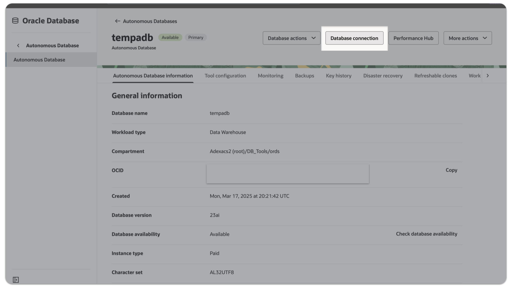

And remember those TNS names for later.

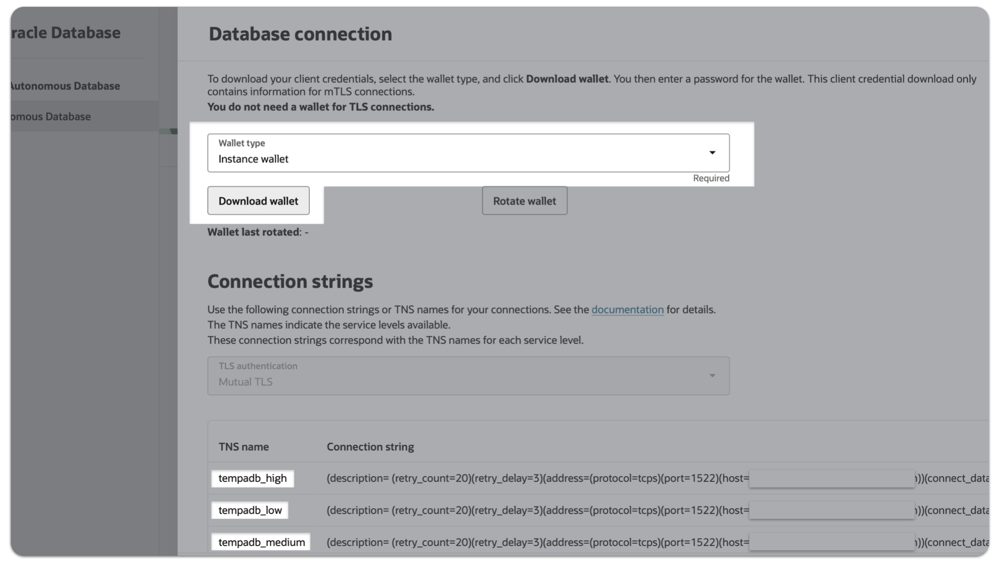

[^421]: And [here](https://docs.oracle.com/en/database/oracle/oracle-rest-data-services/24.4/ordig/installing-and-configuring-customer-managed-ords-autonomous-database.html#ORDIG-GUID-5EC91403-2176-4C62-8793-E32BBF3FE0D0) is everything you'll need to perform a *silent install* for and ORDS *in ADB* installation. I would read through that entire section, just so you understand what is happening during this install.

[^422]: [About the Cloud Wallet](https://docs.oracle.com/en-us/iaas/autonomous-database/doc/download-client-credentials.html
).  

#### 4.2.1 Copy the Cloud Wallet to your compute instance

Securely copy your database wallet into your compute instance. You can do this by opening up another terminal window and issuing the following command (obviously replace these values with your own):

```sh
scp -i [Your compute instance's private key] /the/locally/saved/path/to/your/wallet/Wallet_[your ADB "short name"].zip opc@[your compute instance's IP address]:/home/opc
```

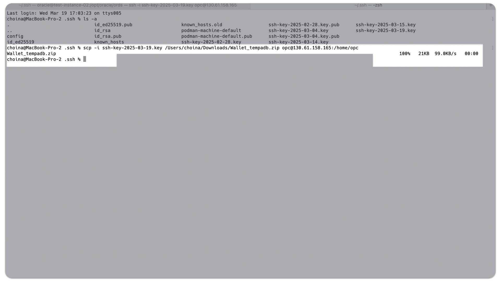

   > :question: **What do I mean by "shortname"?** Its an abbreviated form of your database display name. I'm sure there is a character limit, but this is a pretty short name regardless.
   >
   > 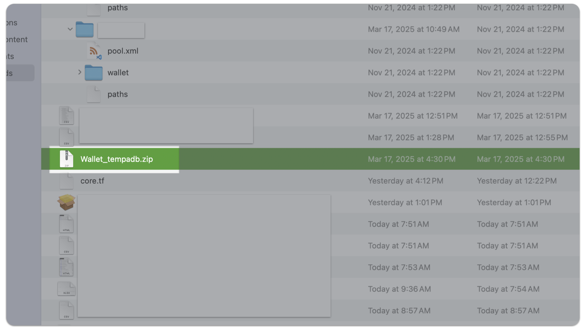

After you copy over the wallet `.zip` file you can verify its existence by navigating to the `/home/opc` directory. You should now see it in there; but you're note finished yet.

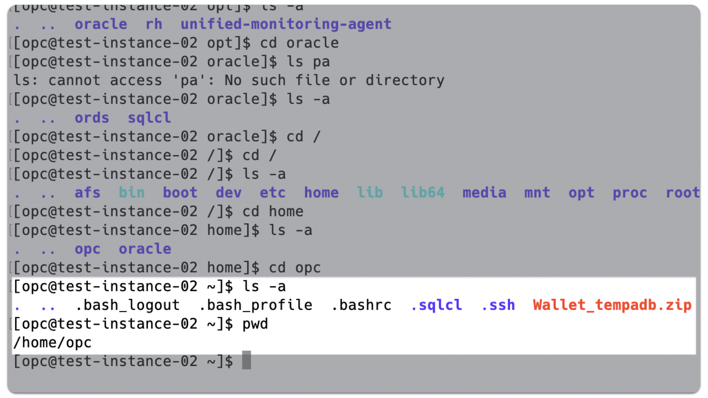

#### 4.2.2 Move the Wallet and change ownership

You need to move the wallet file from `/home/opc/Wallet_tempadb.zip` to `/home/oracle/Wallet_tempadb.zip`. And then change the ownership, like in [this example](https://docs.oracle.com/en/database/oracle/oracle-database/19/asoag/get-started.html#GUID-15CB716C-74A5-42E5-9BCA-7EC9C9FFA712). 

   > :question: **Why?** Because the actual ORDS install is performed by the `oracle` user. And that user needs your cloud wallet. The command I used:

```sh
sudo mv /home/opc/Wallet_tempadb.zip /home/oracle/Wallet_tempadb.zip
```

And then, if you issue the `ls -a` command, you'll see it has been relocated:

```sh
.  ..  .bash_history  .bash_logout  .bash_profile  .bashrc  .ssh
```

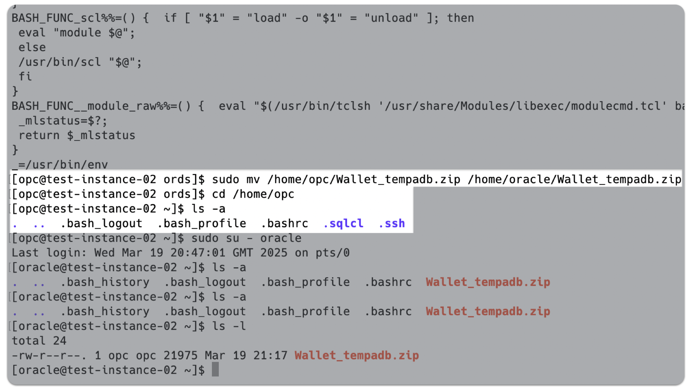

If you switch to the `oracle` user, with `sudo su - oracle`, then issue the `ls -a` command, you'll see the file. Issue the 'ls -l` command to view the file properties.[^4221] You'll see a print out simliar to this[^4222]:

```sh
total 24
-rw-r--r--. 1 opc opc 21975 Mar 17 20:55 Wallet_tempadb.zip
```

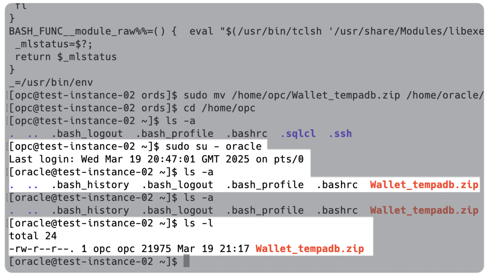

[^4221]: If you don't know about all the available `ls` commands, you should read up on it [here](https://www.gnu.org/software/coreutils/manual/html_node/ls-invocation.html#ls_003a-List-directory-contents).

[^4222]: If you aren't familar with how these file permissions are structured. Or, you don't even know what `-rw-r--r--` means, then read up about it [here](Great resource for what r, rw, r, etc means: https://www.redhat.com/en/blog/linux-file-permissions-explained).

All you really need to know is that the owner and owner group are still `opc`, you'll need to change the owner and group to oracle:oinstall.[^4223]

[^4223]: An [example](https://docs.oracle.com/en/database/oracle/oracle-database/19/asoag/get-started.html#GUID-15CB716C-74A5-42E5-9BCA-7EC9C9FFA712) from the docs, and more info on oracle users and the [oinstall group](https://docs.oracle.com/en/database/oracle/oracle-database/19/ladbi/identifying-an-oracle-software-owner-user-account.html).

So, as the `opc` user, issue the following command:  

`sudo chown oracle:oinstall /home/oracle/Wallet_tempadb.zip`

Then switch back to the `oracle` user to view the changes to the file permissions.

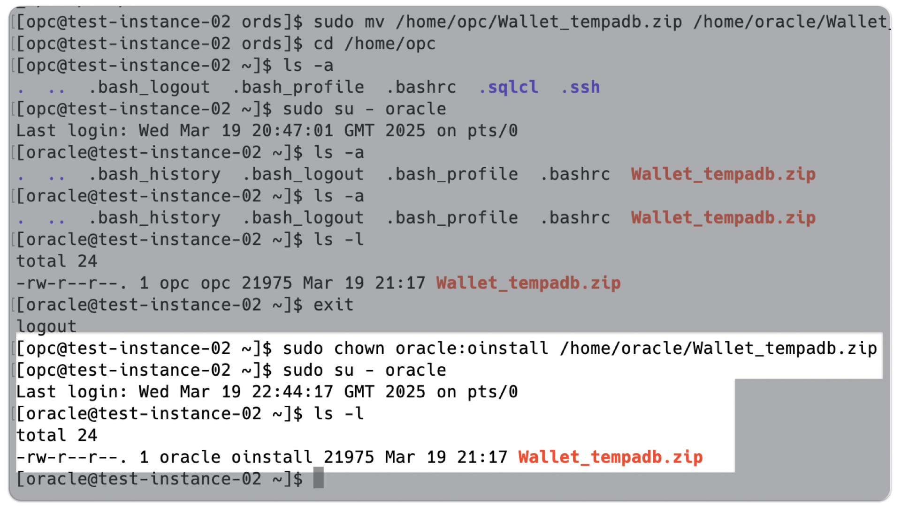

As the `oracle` user issue the `ls -l` command again, and you'll see:

```sh
total 28
-rw-r--r--. 1 oracle oinstall 21975 Mar 17 20:55 Wallet_tempadb.zip
```

<!-- Terraform has [a resource](https://registry.terraform.io/providers/oracle/oci/latest/docs/resources/database_autonomous_database_wallet) for doing this "locally". It looks like you the contents are derived from the var.tf file. That "stuff" all comes from the schema.yaml file. -->

<!-- > :exclamation: **NOTE:** Something to figure out when doing with terraform.

```sh
.  ..  .bash_history  .bash_logout  .bash_profile  .bashrc  .ssh  Wallet_tempadb.zip
```

In directory: `/home/opc/Wallet_tempadb.zip` -->

<!-- Does the `oracle:oinstall` command need to be used? I think I'm going to do this, since for the install the `Oracle` user is the one completing the ORDS install. -->

<!-- At this point, or even sooner, we'd probably need to open up the ports for the compute instance, since ORDS will be running on either port 8080 (HTTP) or 8443 (HTTPS).

sudo firewall-cmd --permanent  --add-port=8080/tcp
sudo firewall-cmd --permanent  --add-port=8443/tcp
sudo firewall-cmd --permanent  --add-port=443/tcp
sudo firewall-cmd --permanent  --add-port=80/tcp
sudo firewall-cmd --reload -->

<!-- https://firewalld.org/documentation/man-pages/firewall-cmd.html

Issuing the `sudo firewall-cmd --list-all-zones`, and you'll see the following:

```sh
block
  target: %%REJECT%%
  icmp-block-inversion: no
  interfaces: 
  sources: 
  services: 
  ports: 
  protocols: 
  forward: yes
  masquerade: no
  forward-ports: 
  source-ports: 
  icmp-blocks: 
  rich rules: 

dmz
  target: default
  icmp-block-inversion: no
  interfaces: 
  sources: 
  services: ssh
  ports: 
  protocols: 
  forward: yes
  masquerade: no
  forward-ports: 
  source-ports: 
  icmp-blocks: 
  rich rules: 

drop
  target: DROP
  icmp-block-inversion: no
  interfaces: 
  sources: 
  services: 
  ports: 
  protocols: 
  forward: yes
  masquerade: no
  forward-ports: 
  source-ports: 
  icmp-blocks: 
  rich rules: 

external
  target: default
  icmp-block-inversion: no
  interfaces: 
  sources: 
  services: ssh
  ports: 
  protocols: 
  forward: yes
  masquerade: yes
  forward-ports: 
  source-ports: 
  icmp-blocks: 
  rich rules: 

home
  target: default
  icmp-block-inversion: no
  interfaces: 
  sources: 
  services: cockpit dhcpv6-client mdns samba-client ssh
  ports: 
  protocols: 
  forward: yes
  masquerade: no
  forward-ports: 
  source-ports: 
  icmp-blocks: 
  rich rules: 

internal
  target: default
  icmp-block-inversion: no
  interfaces: 
  sources: 
  services: cockpit dhcpv6-client mdns samba-client ssh
  ports: 
  protocols: 
  forward: yes
  masquerade: no
  forward-ports: 
  source-ports: 
  icmp-blocks: 
  rich rules: 

nm-shared
  target: ACCEPT
  icmp-block-inversion: no
  interfaces: 
  sources: 
  services: dhcp dns ssh
  ports: 
  protocols: icmp ipv6-icmp
  forward: no
  masquerade: no
  forward-ports: 
  source-ports: 
  icmp-blocks: 
  rich rules: 
	rule priority="32767" reject

public (active)
  target: default
  icmp-block-inversion: no
  interfaces: ens3
  sources: 
  services: dhcpv6-client ssh
  ports: 8080/tcp 443/tcp 80/tcp
  protocols: 
  forward: yes
  masquerade: no
  forward-ports: 
  source-ports: 
  icmp-blocks: 
  rich rules: 

trusted
  target: ACCEPT
  icmp-block-inversion: no
  interfaces: 
  sources: 
  services: 
  ports: 
  protocols: 
  forward: yes
  masquerade: no
  forward-ports: 
  source-ports: 
  icmp-blocks: 
  rich rules: 

work
  target: default
  icmp-block-inversion: no
  interfaces: 
  sources: 
  services: cockpit dhcpv6-client ssh
  ports: 
  protocols: 
  forward: yes
  masquerade: no
  forward-ports: 
  source-ports: 
  icmp-blocks: 
  rich rules: 
```

It looks like everything I just did "took":

```sh
public (active)
  target: default
  icmp-block-inversion: no
  interfaces: ens3
  sources: 
  services: dhcpv6-client ssh
  ports: 8080/tcp 443/tcp 80/tcp
  protocols: 
  forward: yes
  masquerade: no
  forward-ports: 
  source-ports: 
  icmp-blocks: 
  rich rules: 
```

Ports 8080, 443, and 80 are available. I'm not sure if all or some are needed. Or if this is even correct. -->

At this point you know have *most* of what you need to complete an ORDS *slient* ADB installation.

### 4.3 Completing the install

For and ORDS in ADB silent installation, you'll need the following (your configuration will be unique to your own environment, but should mirror this):

| Configuration option | Required | Command Option | Notes |
| -------------------- | :--------: | -------------- |  ----- |
|Database Pool         |        | | You can omit this, ORDS will default to the `/default` database pool. THIS IS OKAY!   |
|Wallet Path | :white_check_mark: | `--wallet /home/oracle/Wallet_tempadb.zip` | Either needs to exist in the same folder as the database pool's config directory, or you need to explicitly name it. Since the idea is to automate this stuff "on the fly," no configuration folders would exist. Its possible to recreate these folders and have them ready to go, but that is a more advanced set-up.<br></br>If you've forgotten the directory, issue the `pwd` command, and add your Wallet.zip file to the end of that path. This will be the value for your `--wallet` command option.|
|Wallet Service Name | | | If we don't include this, then it will simply default to the `Wallet_[the database_"short name"_low` service level. This is okay; the `low` service level is what is in the default ADB ORDS anyways.|
|Admin username |:white_check_mark: | --admin-user ADMIN | This is the "Admin" unique to ADB; the one that was created for you when you first provisioned your Autonomous database. This doesn't exist for a non-ADB installation. You'd use something like PDB_DBA or PDBDBA for this.|
|Admin Password |:white_check_mark: |`--password-stdin < passwords.txt`| For simplicity, the passwords will all be identical. Maybe not the best approach, but for automating and for this example, it will make things much smoother. |
|Runtime Username | :white_check_mark: | `--db-user ORDS_PUBLIC_USER_02` | You already have an `ORDS_PUBLIC_USER` in ADB. That is the "OG" ORDS runtime user. Each time you spin up a new compute instance, it's runtime user would be need to be something like: `ORDS_PUBLIC_USER_COMPUTE_XX` (where "XX" is a variable), or something similar. It just needs to be easily identifiable, easily tracked. |
|Runtime Password | :white_check_mark: | `--password-stdin < passwords.txt` option| Same notes as above. |
|PL/SQL Gateway Username | :white_check_mark: | `--gateway-user ORDS_PLSQL_GATEWAY_01` | An `ORDS_PLSQL_GATEWAY` user already exists. So you can name the subsequent users similar to how you've chosen for the `ORDS_PUBLIC_USER`. Something like: `ORDS_PLSQL_GATEWAY_COMPUTE_XX`|
|PL/SQL Gateway Password | :white_check_mark: | `--password-stdin < passwords.txt` | Same notes as above. |
|Database Actions | :mag_right:| `--feature-sdw true` | While not technially required, if omit this then you by default the ORDS DB API, and the REST-enabled SQL Service. |

#### 4.3.1 Setting up a passwords.txt file

As the `oracle` user you'll want to create a text file that stores your usernames' passwords. Then during the actual install, you can "rdirect STDIN to a file that contains the password" [^431] for each of the following users:

- `admin-user` *aka* the `ADMIN` user
- `db-user` *aka* the `ORDS_PUBLIC_USER`
- `gateway-user` *aka* the `PLSQL_GATEWAY_USER`

[^431]: We cover this in the **Using Input Redirection** [section](https://docs.oracle.com/en/database/oracle/oracle-rest-data-services/24.4/ordig/installing-and-configuring-customer-managed-ords-autonomous-database.html#GUID-5EC91403-2176-4C62-8793-E32BBF3FE0D0).

There are several ways you to create this `.txt` file. I've done this inside the compute instance, with vi.[^4312] The commands I issued, in order:

[^4312]: If you don't know vi, here are some helpful resources: [Oracle](https://docs.oracle.com/cd/E19504-01/802-5826/6i9iclf5v/index.html), [RedHat](https://www.redhat.com/en/blog/introduction-vi-editornk), and [Colorado State](https://www.cs.colostate.edu/helpdocs/vi.html).

```sh
touch passwords.txt
vi passwords.txt
press `i` key to insert text
Add the three passwords, one on each line for:
admin-user
db-user
gateway-user
Press the `esc` key
Enter `wq!` and press enter to save and exit vi
```


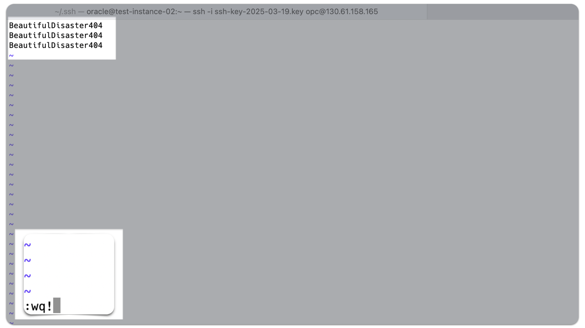

At this point you should have everything you need to complete the install. You can issue the `ls -a` command to verify you see your `passwords.txt` and `Wallet.zip` files:

```sh
[oracle@testinstance01 ~]$ ls -a
.  ..  .bash_history  .bash_logout  .bash_profile  .bashrc  passwords.txt  .viminfo  Wallet_tempadb.zip
```

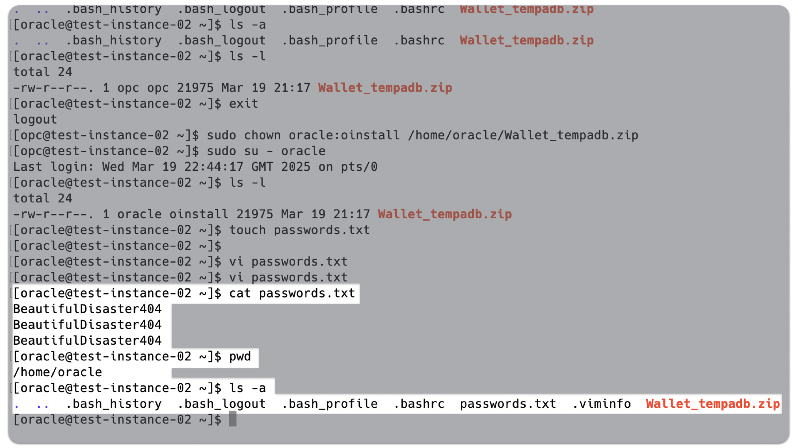

<!-- Installation Checklist
|Stuff| Ready/Complete | Notes |
| --- | :--------------:| --- |
| Correct Java set | <input type="checkbox"/> | GraalVM 17 or above if you want to take advantage of the `MLE/JS` and `GraphQL` features. |
| the ords/config/ folder path | | Remember way back when? You still have to include this too: `--config /etc/ords/config` |
| `passwords.txt` file + file path complete/ready | <input type="checkbox"/> | |
| `port 8080 open`| <input type="checkbox"/> |ORDS needs this for when it starts up, unless you are using HTTPS, then you'll need port 8443. |
| `port 80 open`| <input type="checkbox"/> | Why this? I believe the Network Health Checker uses port 80 for its health checking/reporting. |
| Wallet file ownership changed to `oracle:oinstall` | <input type="checkbox"/> | |
| ORDS CLI command options ready| <input type="checkbox"/> | see Configuration Settings table above | | -->

```sh
ords --config /etc/ords/config install adb --admin-user ADMIN --db-user ORDS_PUBLIC_USER_COMPUTE_01 --gateway-user ORDS_PLSQL_GATEWAY_COMPUTE_01 --wallet /home/oracle/Wallet_tempadb.zip --password-stdin < passwords.txt
```

<!-- Question about the `--config folder location`. We are told to include the folder path in the above command, as: `/etc/ords/config`. BUT, this entire time, we've been in the `/home/oracle` directory. Should we stay in this directory? Will the ORDS know how to "get to" the `/etc/ords/config` folder, even though you are in another directory? The `etc` folder is located a `/`, when you `cd` to it, you are located at `/etc`, cd further, till you are in the `config` folder, and you'll be at `/etc/ords/config`. I guess that makes sense, since `/` is the top. Same as if you were at `/home/oracle`. That initial `/` denotes the top-most level of your directories. So, it probably works.  -->

> :memo: **NOTE:** If you ever get lost as the `oracle` user. Meaning, if you've been navigating around the directories, and you just want to get back to "home base", I just `exit` as the `oracle` user, and then as the `opc` user I issue the `sudo su - oracle` again, that takes you back to the `/home/oracle` location. 

#### 4.3.2 Issuing the ORDS install adb command

Finally, we'll issue the `ords install...` command. However, we have several options we'll plug in, using everything we've created and/or collected. The commands I used:

```sh
[oracle@testinstance01 ~]$ ords --config /etc/ords/config install adb --admin-user ADMIN --db-user ORDS_PUBLIC_USER_COMPUTE_01 --gateway-user ORDS_PLSQL_GATEWAY_COMPUTE_01 --wallet /home/oracle/Wallet_tempadb.zip --feature-sdw true  --password-stdin < passwords.txt
```

And the output you'll see (unless of course you are automating, then you won't see any of this):

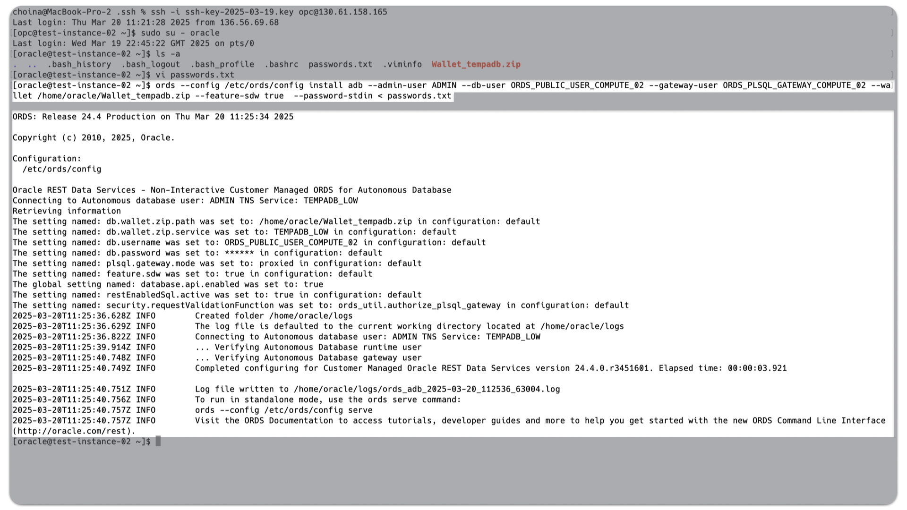

There are three things worth noting:

1. The location of your ORDS configuration folder: `/etc/ords/config`
2. The location of the ORDS installation log file (your date will differ): `/home/oracle/logs/ords_adb_2025-03-18_141224_07526.log`
3. The `ords --config /etc/ords/config serve` command; which you'll use shortly.

You should take this time, to review the new additions to your configuration folders; particularly the `databases` and `global` folders. Here you will find ORDS-related database and connection pool settings.

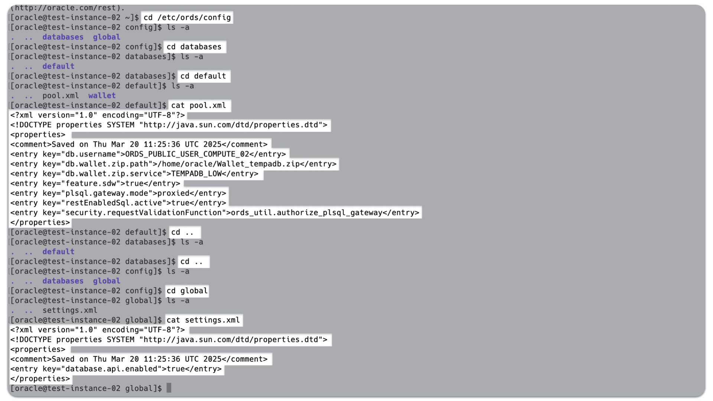

And here is an example of the ORDS installation log file:

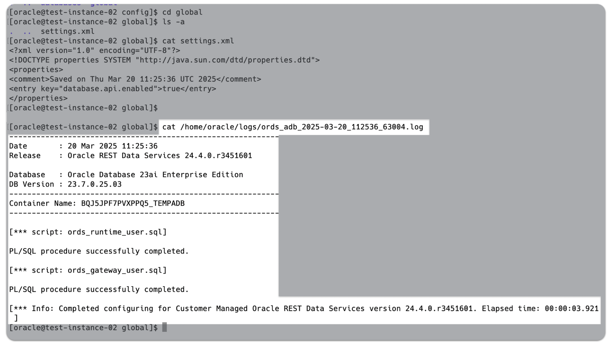

#### 4.3.3 Issuing the ORDS <code>serve</code> command

We are *finally* ready to issue the `ords serve` command. However, since we haven't explicity and permanently set the ORDS configuration directory location, we still need to include that location in our `serve` command.[^433]

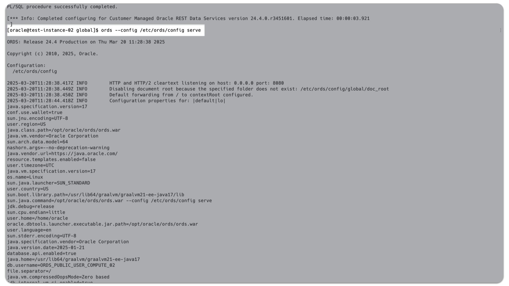

If you see `valid` under the "`Mapped local pools from...`" line, then ORDS has successfully started up in Standalone mode.


[^433]: There are actuall good reasons for why you might not want to *permanently* set the location of your configuration folder. If you are an ORDS power-user, then this doesn't apply. But you can read up on setting the `PATH` for your configuration folder [here](https://docs.oracle.com/en/database/oracle/oracle-rest-data-services/24.4/ordig/installing-and-configuring-oracle-rest-data-services.html#GUID-A12A1E26-3AE1-4DB9-901B-2168613D467A).

#### 4.3.4 Sign-in to Database Actions

If you forget, you can easily obtain your compute instance's *public* IP address by scrolling up in your terminal until you see where you first logged in. Copy the IP address.

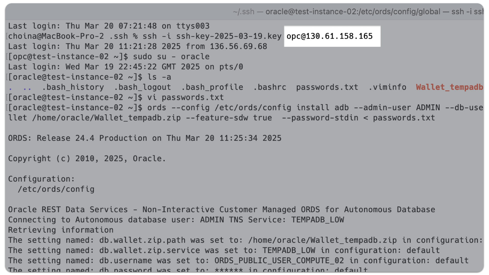

And open up a browser window. And navigate to `your compute instance's IP address` + `8080` + `/ords`. The Database Actions landing page will appear :tada:!

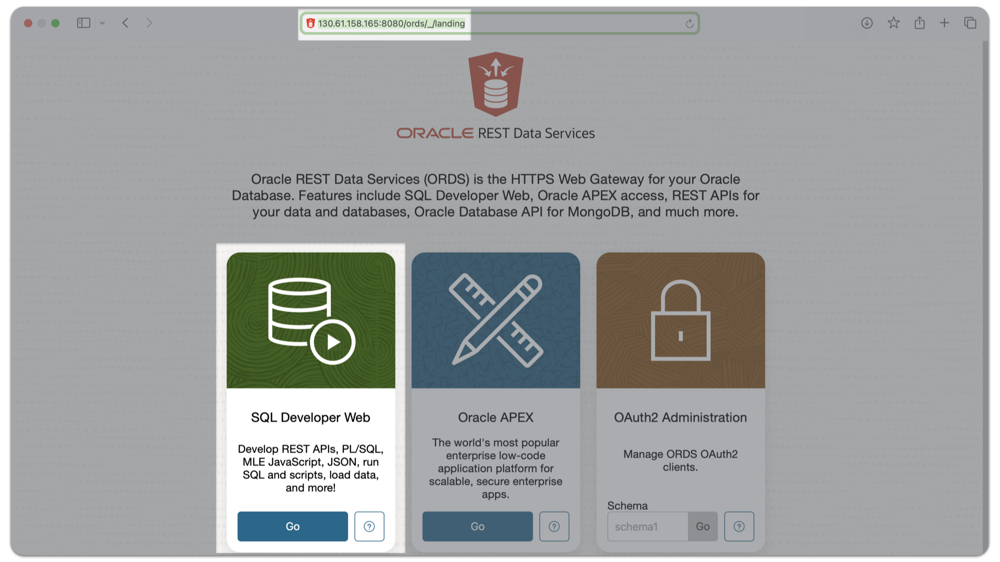

Enter your ADB `ADMIN` credentials, and you'll be taken to the LaunchPad. Everything should be familar to you at this point.

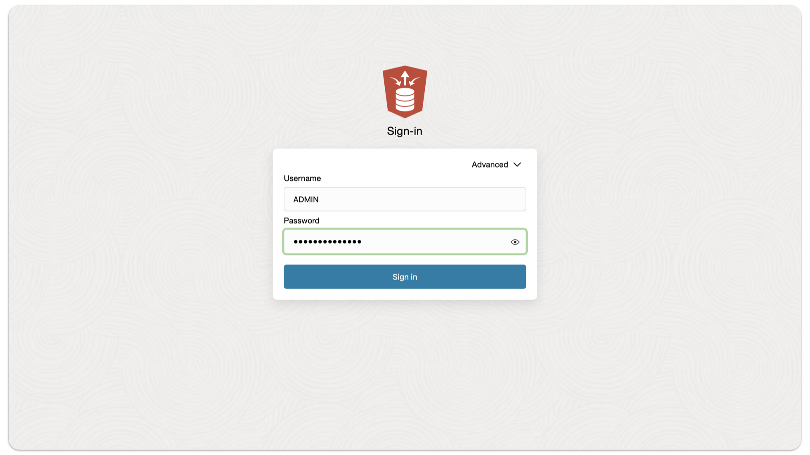

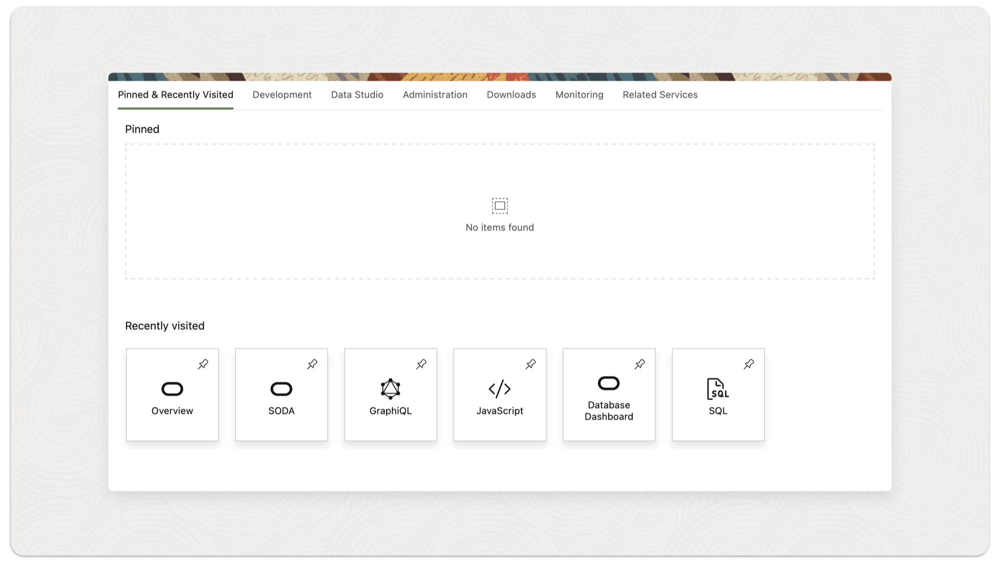

Congratulations, you've just:

1. Created and configured a Compute Instance in OCI
2. Installed ORDS, SQLcl, a supported version of GraalVM
3. Opened up the required ports for HTTP traffic
4. Performed a *silent* ORDS-in-ADB install *using input redirection too*!
5. Successfully logged into Database Actions as the `ADMIN` user

And in case you didn't notice, because you took the time to update your Java to GraalVM, you now have access to the [GraphQL functionality in ORDS](https://docs.oracle.com/en/database/oracle/oracle-rest-data-services/24.4/orddg/graphql-oracle-rest-data-services.html)!

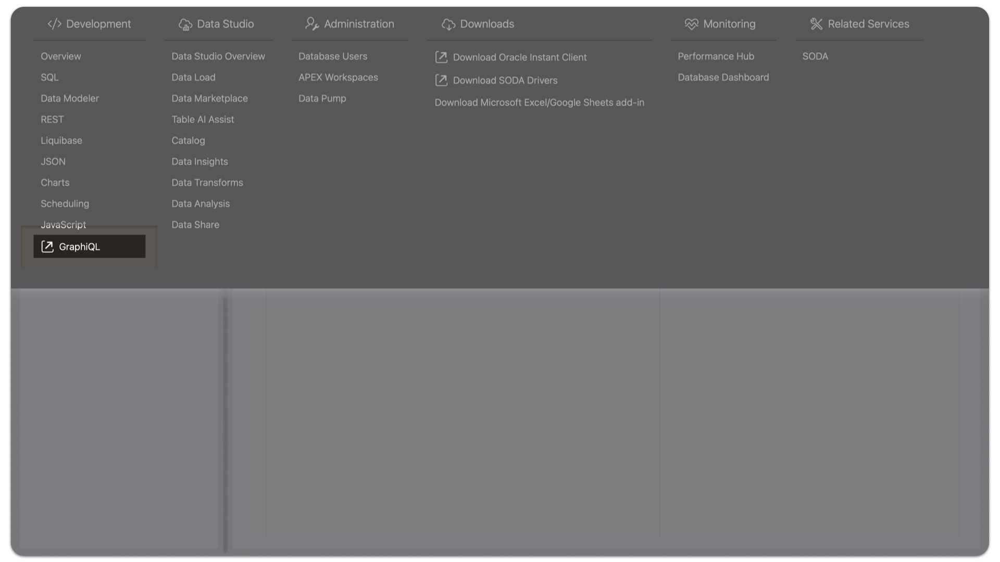

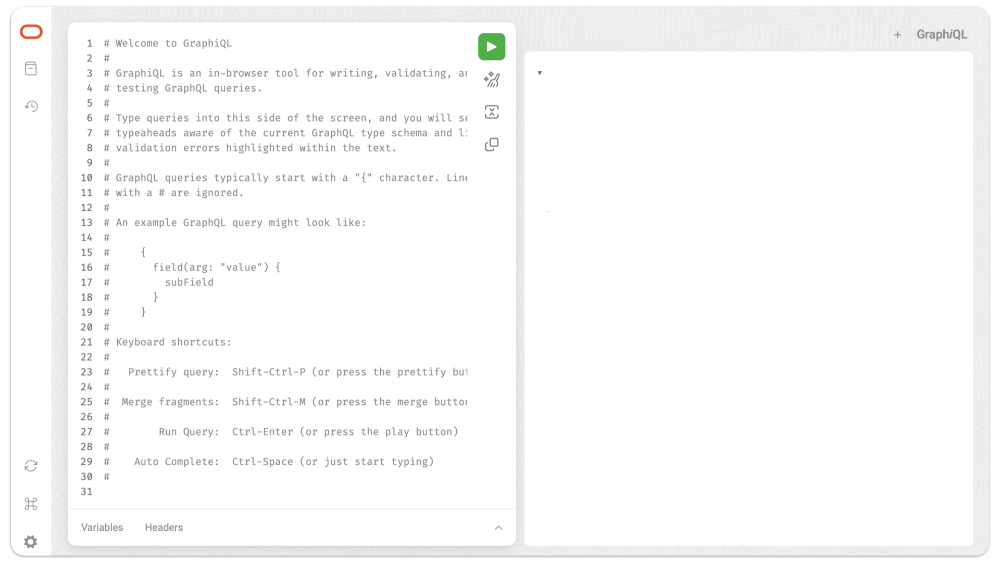

## 5 Where to now?

What we are doing next:

1. Turning this into a proper Terraform stack with: VCN, subnets, route tables, Load Balancers, and support for various Linux OS's and Compute shapes.
2. Reproducing these steps in OCI but for the other two installation configurations: ORDS in Apache Tomcat & ORDS in WebLogic Server
3. Reproducing these steps, but with an [Oracle Base Database Service](https://docs.oracle.com/en/cloud/paas/base-database/about/index.html#articletitle) database.
You tell me...what do you want to see next?

If you've made it this far, congrats. Your certification badge is in the mail.

🫡 See you on the other side.
